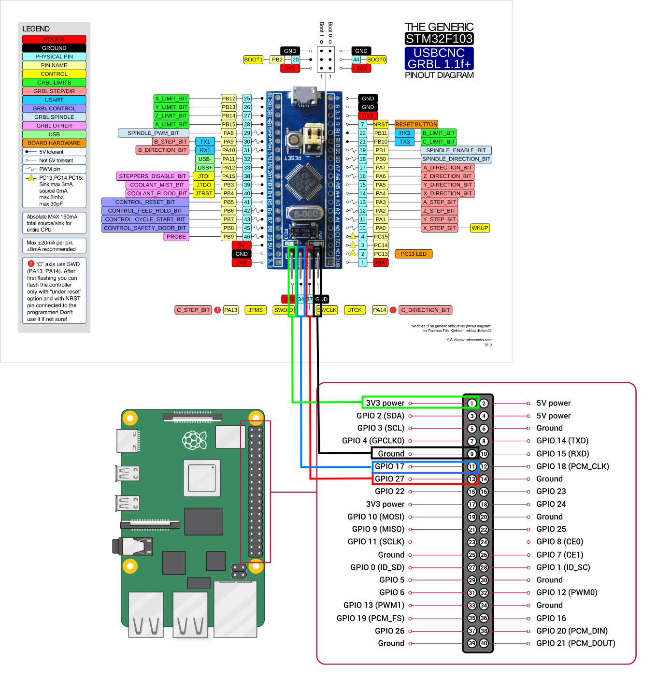

# swd_module

## Introduction

This is a remoteproc kernel module which is implemented by swd_gpio.
Cortex-M MCU by emulating [ARM Serial Wire Debug (SWD) protocol](https://developer.arm.com/documentation/ihi0031/a/The-Serial-Wire-Debug-Port--SW-DP-/Introduction-to-the-ARM-Serial-Wire-Debug--SWD--protocol).
- Some SoCs like raspberry-pi which has powerful application core running Linux kernel but no real-time processing unit. 
- Some MPUs like AM33x used by Beaglebone-Black has a PRU and STM32MP1x has a cortex-m core. 
- This remoteproc kernel module aims to make the SoC which has no sub-core have an external extended cortex-m sub-core and control it by SoC via emulated SWD protocol.

## Wiring
Please refer this figure for the wiring

## Usage

* Please check the remoteproc subsystem usage for Linux kernel.
* Please copy binary in lib/firmware to the /lib/firmware in your rootfs.

Supported mcus:

* stm32f103c8t6([bluepill](https://stm32-base.org/boards/STM32F103C8T6-Blue-Pill.html))

* stm32f411ceu6([blackpill](https://shop.pimoroni.com/products/stm32f411-blackpill-development-board?variant=39274213343315))
